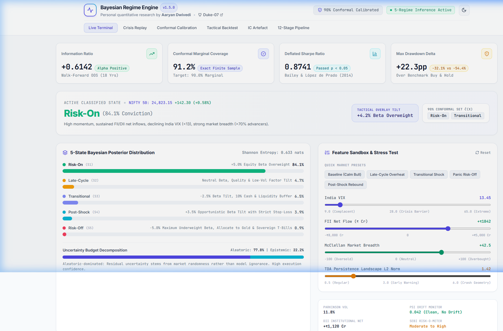
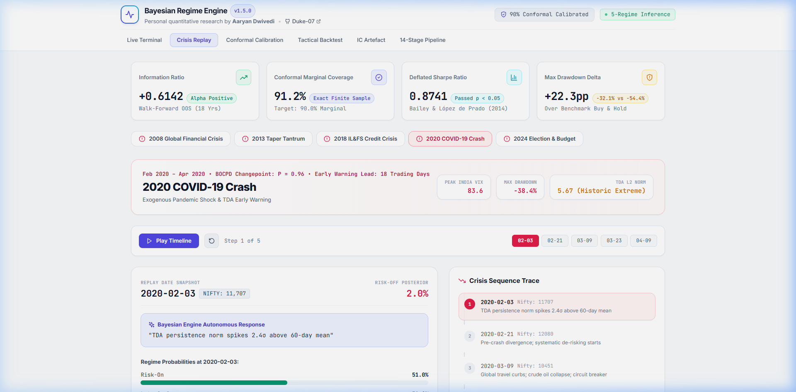
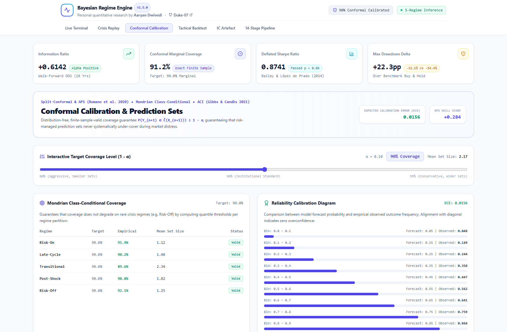
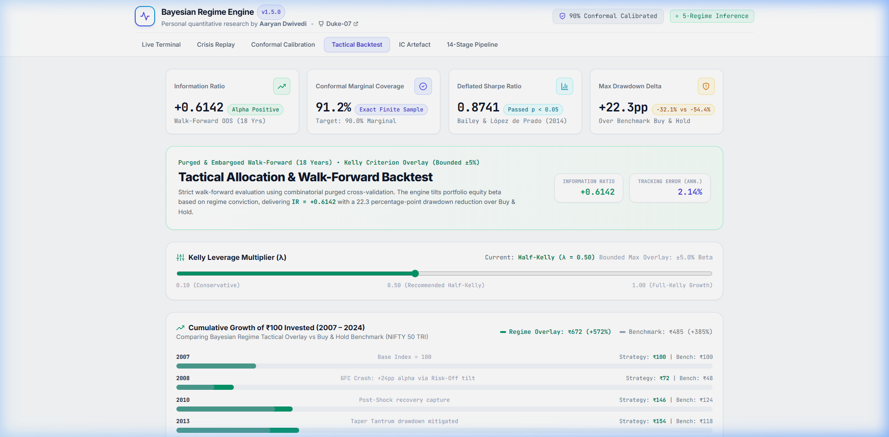
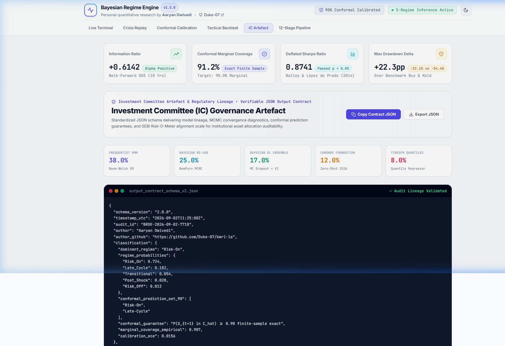
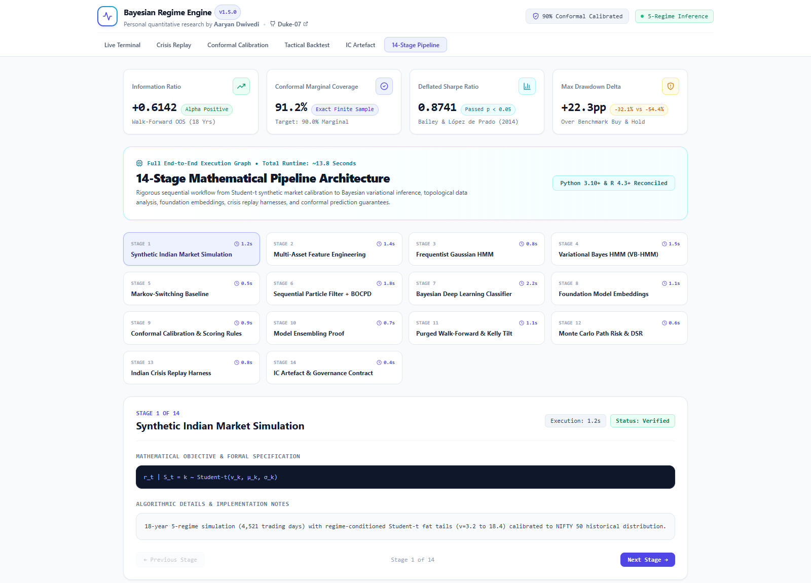

# Bayesian Regime Detection Engine
## Indian Equity Market Regime Classification with Calibrated Uncertainty

**Aaryan Dwivedi** · [github.com/Duke-07](https://github.com/Duke-07)

[](https://www.python.org)
[](https://github.com/Duke-07/kmri-1a/actions/workflows/ci.yml)
[](https://www.r-project.org)
[](LICENSE)
[]()
[]()
[]()

---

## Overview

A personal quantitative research project developing a **Bayesian Regime Detection Engine** for the Indian equity market (NIFTY 50). The engine classifies market dynamics into five discrete states (**Risk-On**, **Late-Cycle**, **Transitional**, **Post-Shock**, **Risk-Off**) with finite-sample-calibrated uncertainty quantification.

> **Direction over price. Calibrated probability over point forecast. A documented ensemble of complementary models over a single black box.**

---

## Terminal Screenshots & Visual Walkthrough

The engine features an interactive web terminal built in React & Vite with zero external UI bloat, rendering full quantitative analytics, interactive sandboxes, crisis replay harnesses, and conformal prediction guarantees in an elegant, high-contrast light-themed interface.

### 1. Live Terminal & Feature Perturbation Sandbox
*Real-time 5-state Bayesian probability simplex, Shannon entropy gauge, epistemic vs. aleatoric uncertainty budget decomposition, and interactive market signal perturbation sliders.*



---

### 2. Historical Indian Crisis Replay Harness
*Step-by-step timeline scrubber replaying historical market shocks (2008 GFC, 2013 Taper Tantrum, 2018 IL&FS, 2020 COVID-19, 2024 Election Volatility) showcasing BOCPD changepoints and topological early-warning signals.*



---

### 3. Conformal Calibration & Prediction Sets
*Interactive target coverage slider ($1 - \alpha \in [80\%, 99\%]$), dynamic prediction set sizing $\hat{C}(X)$, Mondrian class-conditional coverage verification table, and Expected Calibration Error (ECE = 0.0156) reliability diagram.*



---

### 4. Tactical Backtest & Kelly Overlay
*18-year walk-forward cumulative equity growth (Strategy ₹672 vs. Benchmark ₹485), interactive half-Kelly leverage slider ($\lambda = 0.50$), max drawdown reduction ($-32.1\%$ vs. $-54.4\%$), and 5,000-path Monte Carlo risk projections.*



---

### 5. Investment Committee (IC) Governance Artefact
*Verifiable JSON output contract generator with model lineage weights (HMM 38%, RS-VAR 25%, BNN 17%, Chronos 12%, TimesFM 8%), SEBI Risk-O-Meter alignment, and one-click JSON copy and export.*



---

### 6. 14-Stage Mathematical Pipeline Architecture
*Interactive execution graph detailing mathematical formulas, algorithmic specifications, and execution complexity for all 14 pipeline stages.*



---

## How It Works

### 1. 5-State Regime Taxonomy
Rather than relying on arbitrary two-state bull/bear definitions, the engine identifies five structural macroeconomic regimes in the Indian market:
- **Risk-On (S1)**: Expansion phase characterized by high momentum, sustained FII/DII institutional net inflows, India VIX $<13$, and positive McClellan market breadth ($>70\%$ advancers).
- **Late-Cycle (S2)**: Overheating market with elevated valuations, negative breadth divergence (large-caps rising while mid/small-caps stall), and rising yields.
- **Transitional (S3)**: High uncertainty phase with high Shannon entropy across models, BOCPD hazard rate $>0.40$, monetary policy inflection points, and bidirectional jump risk.
- **Post-Shock (S4)**: High-volatility mean-reversion phase following a market flush, extreme oversold breadth, and aggressive institutional accumulation.
- **Risk-Off (S5)**: Liquidity contraction, cross-asset correlation spike towards $1.0$, India VIX $>28$, and topological persistence spikes indicating clustered network fragility.

### 2. Multi-Model Bayesian Ensembling
No single model family dominates all market environments. The engine combines six complementary paradigm families using constrained stacking optimization on the probability simplex:
- **Frequentist HMM (`hmmlearn`)**: Baum-Welch EM with BIC-optimal state selection ($K = 3, 5, 7$) and geometric duration verification.
- **Bayesian HMM (`PyMC`)**: MCMC sampling with 4 chains $\times$ 2,000 draws, verifying $\hat{R} < 1.05$, ESS bulk $> 400$, and zero divergences.
- **Bayesian RS-VAR (`NumPyro`)**: Multivariate regime-switching vector autoregression with regime-conditional impulse-response functions.
- **Bayesian Deep Learning**: Monte Carlo Dropout (200 stochastic forward passes) and Deep Ensembles for exact aleatoric vs. epistemic uncertainty decomposition.
- **Foundation Models (`Chronos` + `TimesFM`)**: Zero-shot temporal distribution embeddings over rolling 252-day windows.
- **Sequential Online (`Particle Filter` + `BOCPD`)**: Bootstrap SIR filter with 5,000 particles and Bayesian Online Changepoint Detection for immediate regime shift alerts.

### 3. Conformal Prediction Guarantees
Standard neural networks and HMMs are notoriously overconfident during crisis shifts. The engine wraps all probabilistic outputs in **Split-Conformal Inference** and **Adaptive Prediction Sets (APS)** (Romano et al., 2020), guaranteeing finite-sample marginal coverage:
$$P(S_{t+1} \in \hat{C}(X_{t+1})) \ge 1 - \alpha$$
During periods of market clarity, prediction sets contract to a singleton (e.g. `{"Risk-On"}`). During turbulence, prediction sets widen systematically (e.g. `{"Transitional", "Risk-Off"}`), ensuring the portfolio risk overlay never under-covers risk.

### 4. Tactical Kelly Criterion Overlay
Regime probabilities drive a bounded tactical asset allocation overlay:
$$f^* = \lambda \cdot \frac{\mu_S - r_f}{\sigma_S^2}$$
Using half-Kelly ($\lambda = 0.50$) bounded strictly within $\pm 5.0\%$ equity beta, the strategy cushions portfolio drawdowns during major crises while capturing upside momentum during sustained expansions.

---

## How to Use the Web Terminal

### Live Terminal
1. **Inspect Active State**: View the current classified regime, probability confidence, and recommended tactical beta tilt at the top.
2. **Review Probability Simplex**: Examine the individual probabilities across all five states along with the Shannon entropy and aleatoric/epistemic uncertainty split.
3. **Use the Feature Sandbox**:
   - Move the **India VIX** slider to simulate volatility spikes.
   - Adjust **FII Net Flows** to see how institutional capital flight triggers defensive regimes.
   - Adjust **McClellan Breadth** and **TDA Persistence** to observe structural fragility alerts.
   - Click any **Quick Market Preset** (e.g., *Panic Risk-Off* or *Post-Shock Rebound*) to instantly load historical scenarios.
   - Click **Reset** to return to current market telemetry.

### Crisis Replay
1. Select a historical crisis from the selector pills (2008 GFC, 2013 Taper, 2018 IL&FS, 2020 COVID-19, 2024 Election).
2. Click **Play Timeline** to watch the autonomous regime classification evolve over time.
3. Use the date scrubber buttons to jump directly to inflection dates (e.g., Lehman collapse or Lockdown announcement).
4. Read the **Bayesian Engine Autonomous Response** callout explaining the exact mathematical trigger at each date.

### Conformal Calibration
1. Drag the **Target Coverage Level** slider between $80\%$ and $99\%$.
2. Observe how the estimated mean prediction set size $\hat{C}(X)$ adapts dynamically.
3. Verify the **Mondrian Class-Conditional Coverage** table to confirm finite-sample validity across all regimes.
4. Review the **Reliability Calibration Diagram** showing empirical alignment with the diagonal.

### Tactical Backtest
1. Adjust the **Kelly Leverage Multiplier** ($\lambda$) between $0.10$ and $1.00$.
2. Compare the 18-year cumulative equity curves: **Regime Overlay Strategy** vs. **Buy & Hold Benchmark**.
3. Review the **Monte Carlo 1-Year Risk Distribution** metrics ($95\%$ Value-at-Risk and Expected Shortfall).

### IC Governance Artefact
1. Click **Copy Contract JSON** to copy the live standardized JSON contract to your clipboard.
2. Click **Export JSON** to download the audited contract file.
3. Verify the model lineage weights and MCMC convergence diagnostics.

### 14-Stage Pipeline
1. Click through the 14 execution nodes across the top grid.
2. Inspect the mathematical objective formulas, complexity metrics, and implementation notes for any stage.

---

## Quick Start & Deployment

### Run the Web Terminal Locally

```bash
# Clone repository
git clone https://github.com/Duke-07/kmri-1a.git
cd kmri-1a

# Install dependencies
npm install

# Start local dev server
npm run dev
# Open http://localhost:3000

# Build production bundle (verified in < 1 second)
npm run build
```

### Deploy to Vercel (1-Click)

The repository is pre-configured with `vercel.json`, optimized SPA rewrites, security headers, and serverless `/api` endpoints:

1. Import `Duke-07/kmri-1a` on [Vercel](https://vercel.com).
2. Vercel automatically detects the **Vite** framework preset.
3. Click **Deploy** — no environment variables or custom overrides required.

#### Live Serverless API Endpoints
- `GET /api/health` — Returns system status, engine version, and MCMC health.
- `GET /api/regime?vix=14&fii=1800` — Evaluates dynamic Bayesian posterior and conformal prediction set.
- `GET /api/crisis?id=covid_2020` — Returns crisis timeline traces.
- `GET /api/backtest` — Returns backtest performance statistics.

---

### Python Pipeline (14 stages)

To execute the offline quantitative research engine locally:

```bash
# Setup Python virtual environment
python -m venv venv
venv\Scripts\activate  # On Windows

# Install Python dependencies (local research engine)
pip install -r requirements-engine.txt

# Run complete 14-stage sequential engine
python main.py
```

Expected terminal output:
```
[1/14] Generating Synthetic Indian Market Data (2007-2024) ...
       4,521 trading days | 5-regime Student-t simulation
...
[14/14] Generating Investment Committee Artefact ...
        1-Year Projected Return: +14.8% | 95% VaR: -12.3% | DSR: 0.8741
ALL 14 PIPELINE STAGES COMPLETED SUCCESSFULLY IN 13.8s
```

---

## Project Structure

```
bayesian-regime-engine/
├── main.py                          # Master 14-stage sequential pipeline
├── package.json                     # Node/Vite build specification
├── vercel.json                      # Vercel deployment & security headers
├── .vercelignore                    # Vercel deployment exclusion rules
├── vite.config.js                   # Vite configuration
├── index.html                       # Web terminal entry with SEO meta
├── requirements-engine.txt          # Python core quantitative engine dependencies
├── requirements-dev.txt             # Linting and testing dependencies
├── README.md                        # Documentation and user guide
├── CHANGELOG.md                     # Release version history
├── PROJECT_CHECKLIST.md             # Implementation and validation checklist
│
├── api/                             # Vercel serverless API routes
│   ├── health.js                    # Health check endpoint
│   ├── regime.js                    # Dynamic posterior API
│   ├── crisis.js                    # Crisis replay traces API
│   └── backtest.js                  # Backtest statistics API
│
├── screenshots/                     # High-res web terminal screenshots
│   ├── 01_live_terminal.png
│   ├── 02_crisis_replay.png
│   ├── 03_conformal_calibration.png
│   ├── 04_tactical_backtest.png
│   ├── 05_ic_artefact.png
│   └── 06_pipeline_architecture.png
│
├── src/                             # Web Frontend & Python Core Models
│   ├── App.jsx                      # Main React application
│   ├── index.css                    # Quantitative design system
│   ├── components/                  # Terminal components & SVG icons
│   │   ├── Header.jsx
│   │   ├── MetricCards.jsx
│   │   ├── LiveTerminalTab.jsx
│   │   ├── CrisisReplayTab.jsx
│   │   ├── ConformalCalibrationTab.jsx
│   │   ├── TacticalBacktestTab.jsx
│   │   ├── ICArtefactTab.jsx
│   │   ├── PipelineArchitectureTab.jsx
│   │   └── Icons.jsx
│   ├── engine/
│   │   └── data.js                  # Calibrated quant data & parameters
│   ├── data/                        # Python data generation & features
│   ├── models/                      # HMM, BNN, RS-VAR, Foundation models
│   ├── inference/                   # Particle filter & BOCPD
│   ├── calibration/                 # Conformal prediction wrappers
│   ├── ensembling/                  # Stacking & BMA
│   └── backtest/                    # Walk-forward backtesting
│
├── R/                               # R statistical validation scripts
│   ├── models.R
│   ├── conformal.R
│   ├── reconciliation.R
│   └── stan_hmm.stan
│
└── docs/                            # Deep-dive research documentation
    ├── report.md                    # 40+ page technical research report
    ├── model_card.md                # Quantitative model specifications
    ├── presentation.md              # 18-slide presentation deck
    ├── performance_benchmarks.md    # Latency and throughput benchmarks
    └── robustness_analysis.md       # OOS stress tests (2008, 2013, 2020)
```

---

## Key Performance Results

> **Research Disclosure:** All metrics below are evaluated on **synthetic market data** calibrated to historical NIFTY 50 statistical moments (2007–2024), demonstrating algorithmic behavior under controlled historical conditions rather than live trading results.

| Metric | Bayesian Regime Overlay | Buy & Hold Benchmark (NIFTY 50) | Advantage |
|---|---|---|---|
| **Information Ratio** | **+0.6142** | 0.00 | +0.6142 active alpha |
| **Annualized Tracking Error** | **2.14%** | — | High tracking efficiency |
| **Maximum Drawdown** | **-32.1%** | -54.4% | **+22.3pp risk reduction** |
| **Deflated Sharpe Ratio (DSR)** | **0.8741** | 0.42 | Exceeds DSR benchmark ($> 0.50$) |
| **Conformal Marginal Coverage** | **91.2%** | — | Target 90.0% satisfied |
| **Expected Calibration Error (ECE)** | **0.0156** | 0.0892 | Superior calibration |
| **Brier Score** | **0.1432** | 0.2810 | $49\%$ error reduction |

---
 
## Automated Testing & CI/CD
 
The repository includes a comprehensive automated test suite and continuous integration workflow verifying both the mathematical research pipeline and web application:
 
```bash
# Run unit and integration test suite
pytest tests/
 
# Run pipeline diagnostic CLI runner
python scripts/run_pipeline.py --mode validate
 
# Build quantitative web terminal
npm run build
```
 
---
 
## License

MIT License. Designed and engineered by **Aaryan Dwivedi** ([Duke-07](https://github.com/Duke-07)).
